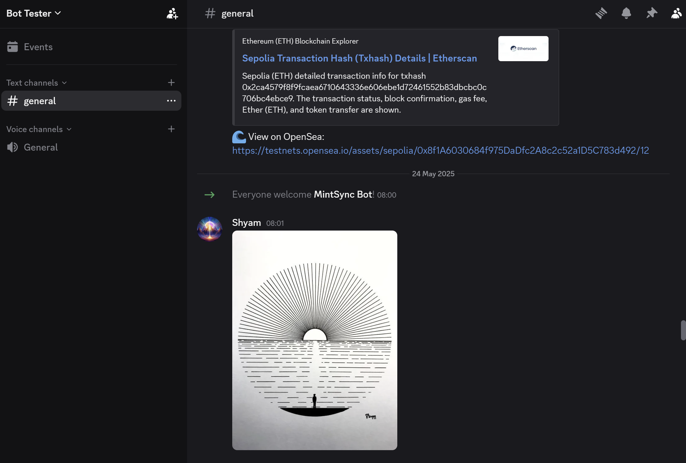
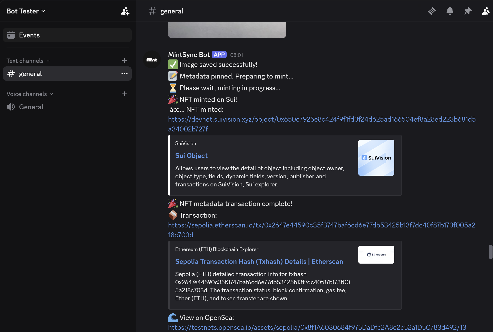
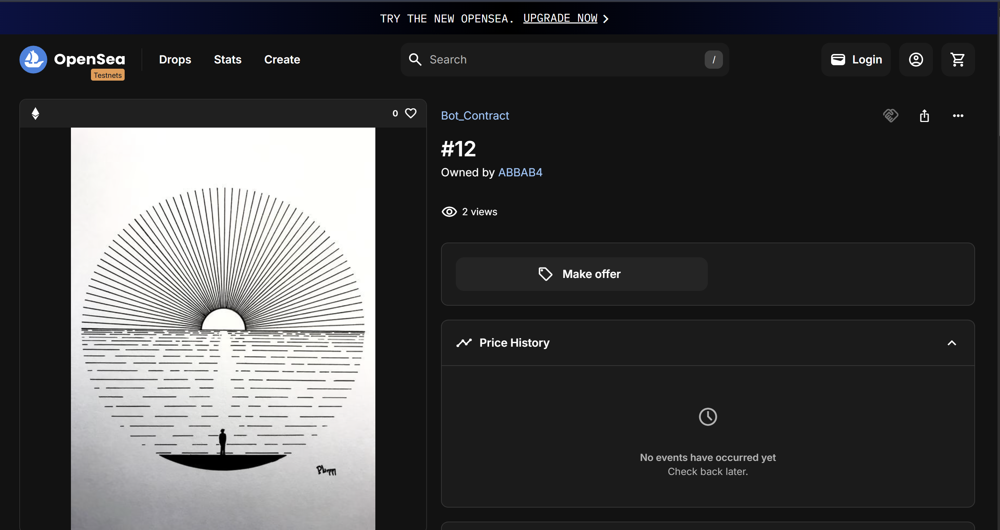
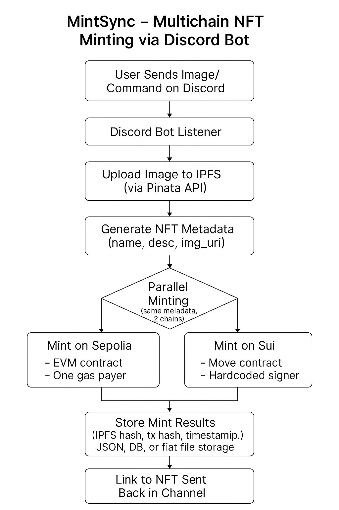

# MintSync

**MintSync** is a cross-chain NFT minting Discord bot that automatically turns uploaded images into NFTs on both the **Ethereum (Sepolia Testnet)** and the **Sui blockchain**. Just drop an image in a designated Discord channel, and MintSync handles everything — from IPFS pinning to smart contract minting.

---

## 🚀 Features

- 🔗 **Cross-Chain Minting** – Mint NFTs on Ethereum (via `web3.py`) and Sui (via Move contracts).
- 🤖 **Discord Bot Integration** – Mint NFTs just by uploading images to Discord.
- 📥 **IPFS Storage** – Automatically uploads images and metadata to IPFS via Pinata.
- ⚙️ **Move Smart Contracts** – Sui NFT minting handled via custom Move modules.
- 📜 **Ethereum Contract** – Supports minting using existing smart contracts on Sepolia.
- 📦 **Lazy Minting** – Mint only when triggered by user actions, reducing gas and clutter.

---

## 🧩 Tech Stack

| Layer        | Technology                  |
|--------------|-----------------------------|
| Bot Engine   | `discord.py`                |
| Ethereum     | `web3.py`, Sepolia Testnet  |
| Sui          | `@mysten/sui.js`, Move Lang |
| IPFS         | `pinata-python`, Pinata     |
| Storage      | `IPFS`, `.env`, local files |
| Scripts      | `Python`, `JavaScript`      |

---

## 📁 Project Structure
```
MintSync/
├── images/                         # Saved image uploads
├── nft_mint_sui/
│   ├── sources/
│   │   └── nft_mint.move           # Move module for minting
│   ├── build/                      # Build output (auto-generated)
│   └── Move.toml                   # Sui project configuration
├── abi.txt                         # Ethereum contract ABI
├── main.py                         # Discord bot logic
├── transaction.py                  # Ethereum mint logic
├── transaction_sui.js              # Sui mint logic
├── .env                            # Environment variables
├── requirements.txt                # Python dependencies
├── package.json                    # Node.js project config
├── MINT_COUNTER_FILE.txt           # Keeps track of minted NFTs
├── assets/
│   ├── logo.png                    #logo
└── README.md                       # You're here!
```
---

## ⚙️ Setup Instructions

### 1. Install Dependencies

#### Python
```bash
pip install -r requirements.txt
```
#### Node.js
```bash
npm install
```

### 2. Environment Variables

Create a `.env` file in the root with the following:

```env
# Discord Bot
BOT_TOKEN=your_discord_bot_token

# Pinata API Keys
PINATA_API_KEY=your_pinata_api_key
PINATA_SECRET_KEY=your_pinata_secret_key

# Ethereum (Sepolia)
WALLET_ADDRESS=your_wallet_address
WALLET_PRIVATE_KEY=your_private_key

# Sui Blockchain
SUI_PRIVATE_KEY=your_sui_private_key_hex
SUI_RPC_URL=[https://fullnode.devnet.sui.io:443](https://fullnode.devnet.sui.io:443)
PACKAGE_ID=your_move_package_id
```

### 3. Run the Bot

```bash
python main.py
```
Make sure the bot is invited to your Discord server with the necessary permissions (message read/send, attach files).

---

## 🧪 How It Works

1.  User uploads an image to a designated Discord channel.

2.  The bot:
    * Downloads the image.
    * Pins it to IPFS.
    * Creates and pins a metadata JSON file.
    * Mints the NFT on both:
        * Ethereum (Sepolia) via Web3
        * Sui Blockchain via Move
3.  Bot replies with the minted NFT links (Etherscan, SuiVision, etc.)




---
### Flow Chart




### ✅ Sui Move Module

```move
public entry fun mint_nft(
    name: String,
    description: String,
    url: String,
    ctx: &mut TxContext
)
```
This mints a new NFT struct and transfers it to the caller’s wallet.

Package Id - 0x6df7dc2f60303c6e05905aa94d31c59fc8ad3c7df002bbc6fd0aded773f08f0e

### ✅ Ethereum Contract

Uses an **ERC-721 contract** with a `publicMint(string)` function. You must deploy this beforehand and update `abi.txt` and the contract address in your code.

Contract address - 0x8f1A6030684f975DaDfc2A8c2c52a1D5C783d492

---

## 🧠 Made With

* 🐍 `discord.py`
* 📦 `web3.py`
* 🌊 `@mysten/sui.js`
* 🧠 Move Language
* 🌐 IPFS + Pinata

---

Happy minting with **MintSync**!
